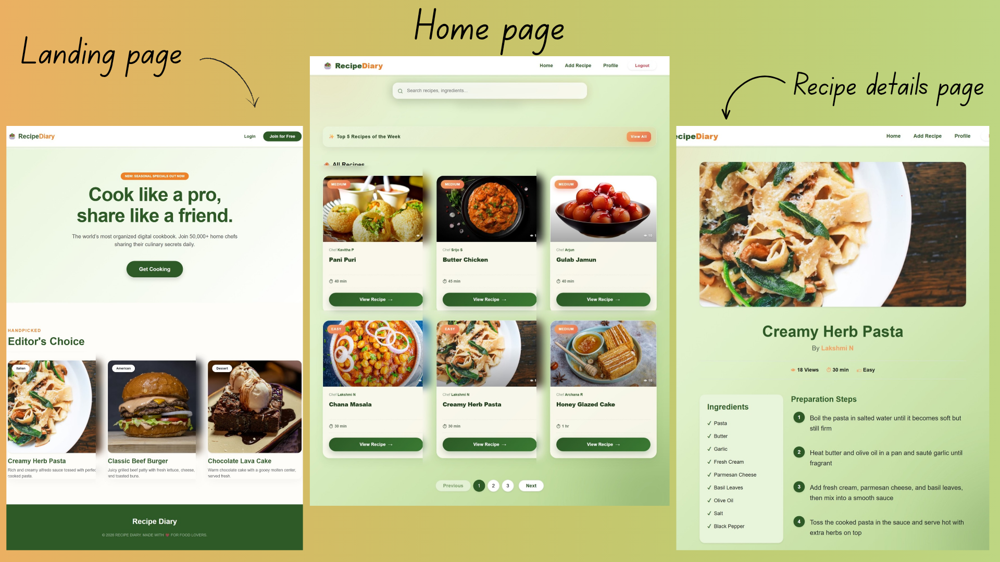
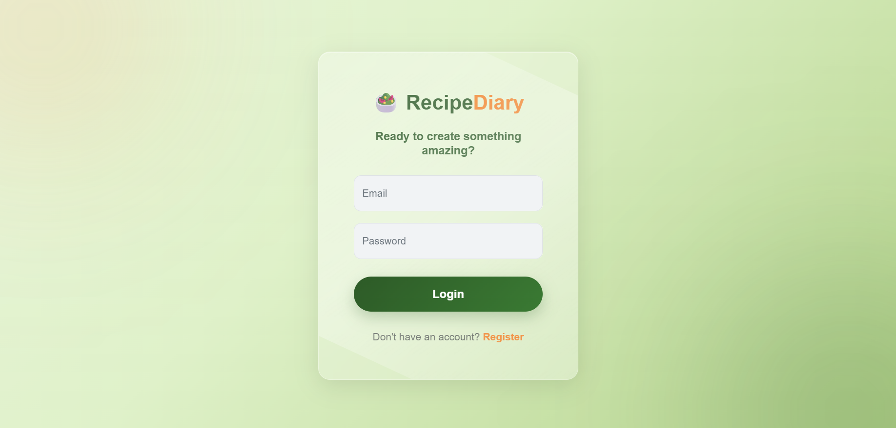

# Recipe Diary 🍲

A full-stack Recipe Management Web Application built using Django, Django REST Framework, React, and MySQL. The application allows users to create, manage, and organize recipes through a clean and interactive interface.

This project was developed to strengthen my understanding of full-stack web development, REST APIs, frontend-backend integration, authentication workflows, and database management.

---
##  Project Preview

##  Authentication Page

---
##  Features

- Create, Edit, and Delete Recipes
- Secure User Authentication
- Recipe Image Upload Support
- Dynamic Recipe Listing
- Detailed Recipe View Page
- Responsive User Interface

---

##  Tech Stack

 Frontend - React.js

 Backend - Django

 Database - MySQL

 Tools & Technologies - Git, GitHub, VS Code

---

## 👩‍💻 Author

**Archana R**

GitHub:  
https://github.com/archanarx
